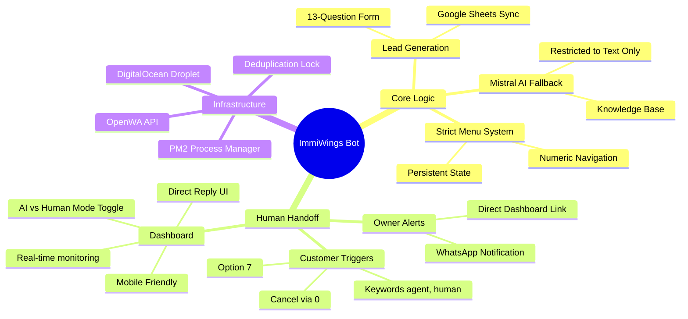
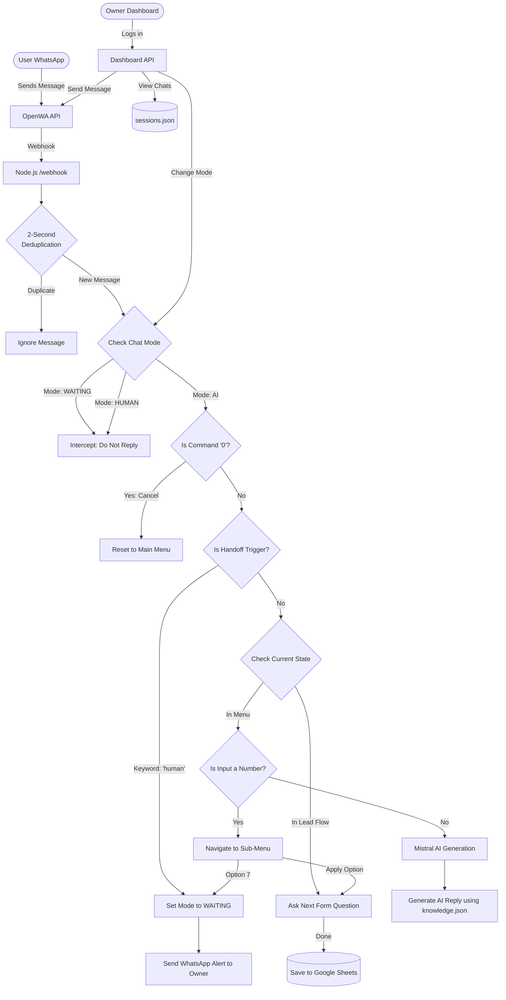

# ImmiWings WhatsApp Bot

This repository contains the source code for the ImmiWings WhatsApp chatbot. The bot integrates OpenWA, Mistral AI, Google Sheets, and a premium Human Handoff Dashboard.

---

## 🔄 Server Update Guide

If changes are made to this codebase and you need to deploy them to your live server, follow these exact steps. **Do not copy-paste them all at once; run them one by one.**

### Step 1: Connect to your Server
Open your regular Windows PowerShell and log into your server:
```bash
ssh root@157.230.237.206
```

### Step 2: Navigate to the Bot Folder
```bash
cd ~/immigration-whatsapp-bot
```

### Step 3: Fetch and Force-Update the Code
This deletes any accidental local changes and strictly pulls the exact code from GitHub:
```bash
git fetch origin main
git reset --hard origin/main
```

### Step 4: Restart PM2 and Apply Environment Variables
This restarts the bot and ensures it reads any updates you made to your `.env` file:
```bash
pm2 restart immigration-bot --update-env
```

*(Note: If you only changed your `.env` file—like connecting a new OpenWA session—you only need to run Step 2 and Step 4.)*

---

## 🧠 Chatbot Architecture & Feature Map

Below is a complete breakdown of the bot's capabilities and how the logic flows.

### 1. Feature Mind Map



### 2. Interaction Logic Flowchart



---

## 🔗 Important Links & Configuration

### 1. Human Handoff Dashboard
- **URL:** [http://157.230.237.206:3000/dashboard](http://157.230.237.206:3000/dashboard)
- **Password:** `admin123` *(Unless changed in `.env`)*

### 2. OpenWA API Interface
- **URL (Sessions Management):** [http://157.230.237.206:2886/sessions](http://157.230.237.206:2886/sessions)

### 3. How to Change the Bot's Phone Number
If you need to connect a brand-new WhatsApp number to the bot, follow these steps exactly:

1. **OpenWA Setup:** 
   - Go to the OpenWA Interface (`http://157.230.237.206:2886/sessions`) and generate a **New Session**.
   - Make sure to set the **Webhook URL** for the new session to exactly: `http://157.230.237.206:3000/webhook` (Method: POST).
   - Scan the QR code with your new phone.

2. **Update Server `.env`:**
   - Run `nano ~/immigration-whatsapp-bot/.env` on the server.
   - Update `OPENWA_SESSION_ID` with the new Session ID.
   - Update `OWNER_WHATSAPP_NUMBER` if your personal phone number also changed.
   - Save and exit (`Ctrl+O`, `Enter`, `Ctrl+X`).

3. **Restart the Bot:**
   - Run `pm2 restart immigration-bot --update-env` to apply the new `.env` settings.
